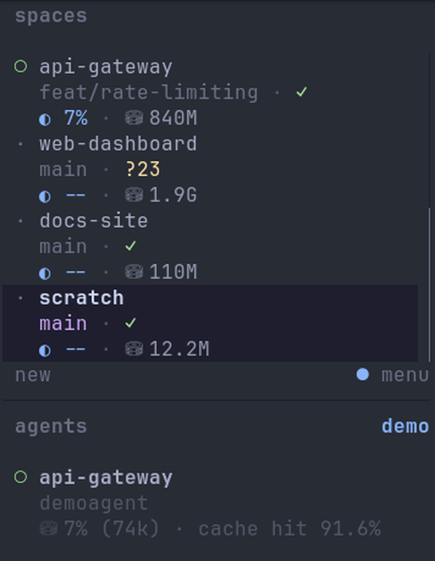
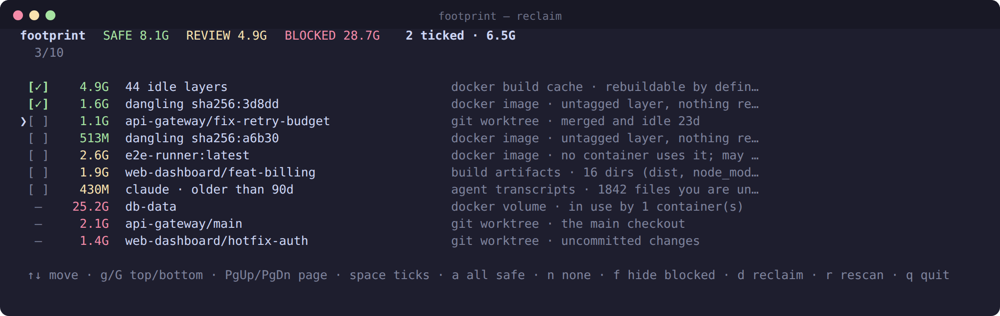

<div align="center">

# herdr-footprint

### What each space actually costs you — in disk, and in context.

Two numbers per space in your [herdr](https://herdr.dev) sidebar: how much disk its
git worktree occupies, and how much of its context window the busiest agent in it
has already burned — whichever agent that is.


<p>
  <a href="#why-youd-want-it">why</a> ·
  <a href="#install">install</a> ·
  <a href="#tokens">tokens</a> ·
  <a href="#the-reclaim-pane">reclaim</a> ·
  <a href="#how-it-works">how it works</a> ·
  <a href="#configuration">configuration</a> ·
  <a href="#roadmap">roadmap</a>
</p>

</div>

<div align="center">

</div>

## Why you'd want it

You can see which agent is blocked. You cannot see which space is about to run out
of context, or which one is quietly holding 13 GB of `node_modules` you stopped
needing three branches ago.

Every other sidebar plugin reports **per machine** (CPU, RAM, free disk) or **per
agent** (tokens, rate limits). Those are the wrong units for a decision you make per
space: *is this one finished with me?*

- **`◐ 7%`** next to a space — room to keep going there.
- **`◐ 94%`** — that space is one long turn from a compaction you did not plan.
- **`⛁ 1.9G`** against a branch you merged last week — that is your disk alert, waiting.

Both answers, without focusing a single tab.

Above: four spaces, each showing its branch and git status, then what it costs.
`web-dashboard` is carrying 1.9 GB and 23 untracked files; `scratch` is 12 MB and
clean. Only `api-gateway` has an agent in it, so it is the only one reporting
context — a space with no agent shows `--`, which is the honest answer rather than
a zero.

## Install

```bash
herdr plugin install harpal-singh-qp/herdr-footprint
```

No toolchain, no compile step — bash and python3, both of which you already have.

Then reference the tokens in your space rows in `~/.config/herdr/config.toml`:

```toml
[ui.sidebar.spaces]
rows = [
  ["state_icon", "workspace"],
  ["branch", "git_status"],
  [{ token = "$ctx", fg = "#89b4fa" }, { token = "$disk", fg = "#9399b2" }],
]
```

```bash
herdr server reload-config
```

That is the whole setup. The poller starts itself on the next herdr launch, or
immediately with `herdr plugin action invoke start --plugin footprint`.

### Colour by value (herdr 0.9.0+)

On 0.9.0 and later, tokens can restyle themselves by value — so a space turns yellow
as it fills and red before it bites:

```toml
  [{ token = "$ctx", fg = "#89b4fa", rules = [
      { gt = 70, fg = "#f9e2af" },
      { gt = 85, fg = "#f38ba8", bold = true } ] },
   { token = "$disk", fg = "#9399b2" }],
```

## Tokens

| Token | Example | Meaning |
| --- | --- | --- |
| `$disk` | `⛁ 840M` | Size of the space's git worktree root (`du -sx`) |
| `$ctx` | `◐ 7%` | Largest context-window share among the space's agent panes |

Both fall back to `--` instead of vanishing, so a configured row never collapses.

## How it works

A `[[startup]]` hook detaches a poll loop, because herdr's startup hook is one-shot.
Each cycle:

1. Lists spaces, resolving each one's directory from its first pane's `cwd`.
2. Resolves that to the **git worktree root**. Several spaces commonly live in
   subdirectories of one checkout, and the worktree is what occupies disk — measuring
   `cwd` would report a subdirectory as if it were the whole cost.
3. Pushes `$disk` (from cache) and `$ctx` via `workspace report-metadata`.
4. Re-measures **exactly one** worktree: the stalest one past its TTL.

Step 4 is the design. A 13 GB checkout takes ~14 s to walk and a 2 GB one ~5 s, so
measuring every space every tick would keep a core busy permanently. One walk per
cycle keeps the sidebar populated without this plugin ever being why your fan spins.

### Where context comes from

Two sources, in order:

1. **A `context` metadata token on the pane.** Usage plugins such as
   [herdr-agent-usage](https://github.com/senna-lang/herdr-agent-usage) publish one
   per pane for Claude, Codex, OpenCode, Grok, Pi, omp, Cursor and direct API
   backends. Preferring it means footprint covers every provider those plugins
   cover, and never has to track a transcript format it does not own.
2. **Claude's own transcript**, so a space still reports something useful when no
   usage plugin is installed.

Source 2 has a wrinkle: Claude transcripts record token usage but never the context
window. A session that has already passed 200k tokens proves it is on the 1M window,
so the window is inferred rather than assumed. Pin it with `FOOTPRINT_CONTEXT_WINDOW`
if you would rather be explicit. Source 1 needs none of this — the publishing plugin
already knows the window.

## Configuration

`$HERDR_PLUGIN_CONFIG_DIR/config.env` — shell syntax, every key optional:

| Variable | Default | Meaning |
| --- | --- | --- |
| `FOOTPRINT_CADENCE_SEC` | `60` | Seconds between push cycles |
| `FOOTPRINT_REMEASURE_SEC` | `900` | Minimum age before a worktree is walked again |
| `FOOTPRINT_CONTEXT_WINDOW` | `0` | `0` infers; set e.g. `200000` to pin |
| `FOOTPRINT_TRANSCRIPT_DAYS` | `90` | Age at which agent transcripts count as stale |
| `FOOTPRINT_DISK_ICON` | `⛁` | |
| `FOOTPRINT_CTX_ICON` | `◐` | |

## The reclaim pane

Sidebar tokens tell you *that* a space is expensive. The reclaim pane tells you
*what you can do about it*:



Open it with `footprint.reclaim`, or bind a key:

```toml
[[keys.command]]
key = "prefix+shift+k"
type = "shell"
command = "herdr plugin action invoke reclaim --plugin footprint"
description = "footprint: what can I reclaim?"
```

The report adapts to the pane width, so it stays readable in a narrow split, and the
list is drawn through a viewport rather than printed whole — see the key table below.

### Movement, and rows that never leave

Each scan records its totals, so the header shows what changed:

```
  SAFE     7.8G -3.2G   REVIEW    19.8G   BLOCKED    42.5G +1.1G   vs 3d ago
```

Individual items are timestamped the first time they appear, and a row that has
been present for three days or more says so:

```
  4.9G  44 idle layers    docker build cache · rebuildable by definition · here 9d
```

That annotation is the useful one. A row sitting in **SAFE** for three weeks is one
you keep declining to act on — which is a fact about the rule, not about you. It is
the signal to trust before letting anything be reclaimed unattended.

The comparison deliberately ignores any scan from the last 12 hours, so pressing `r`
repeatedly does not collapse the window and report "no change". History is capped at
500 entries and items are forgotten 30 days after they stop appearing.

### The three classes

| Class | Means | Examples |
| --- | --- | --- |
| **SAFE** | Rebuildable by definition, or merged and idle ≥ 7 days | idle build cache, dangling images, merged stale worktrees, build artifacts in a worktree you are done with |
| **REVIEW** | Provably unused, but holds something worth a glance | untagged-but-unused images, unused volumes, agent transcripts, build artifacts in a worktree still in use |
| **BLOCKED** | A fence failed — **always shown with the reason** | in-use volumes, unmerged branches, uncommitted changes, the worktree you are standing in |

A BLOCKED row is not a failure to classify. It is the answer: *this is why that
space is not yours yet.* Hiding it would just make you go looking.

**Build artifacts are found and subtracted.** `node_modules`, `target`, `dist`,
`build`, `.next`, `.turbo` and `vendor` inside each worktree get their own row, and
those bytes come off the worktree's own figure — `du` already counted them once, and
listing both would report the same space twice. On a monorepo this is usually the
single largest reclaimable line: one checkout here reads 2.1 GB, of which 1.5 GB is
`node_modules`.

Artifacts in a worktree you cannot delete are **REVIEW**, not SAFE: they are still
rebuildable, but removing them stops a dev server you have running right now.

Figures are reconciled against the tools themselves — build cache excludes shared
layers, so the total matches `docker system df`'s own RECLAIMABLE column rather than
inflating it roughly fourfold.

### Reclaiming

Every row that can be acted on carries a checkbox. `space` ticks the one under the
cursor and moves down, so ticking a run of rows is one key repeated:

```
❯[✓]   4.9G  44 idle layers            docker build cache · rebuildable by definition
 [✓]   1.6G  dangling sha256:3d8dd     docker image · untagged layer
 [ ]   513M  dangling sha256:a6b30     docker image · untagged layer
  –   25.2G  db-data                   docker volume · in use by 1 container(s)
```

A **BLOCKED** row shows `–` rather than an empty box. An unticked checkbox invites a
click, and that row is the one thing here that cannot be ticked.

The list is drawn through a viewport that follows the cursor, so it stays usable
however long it gets:

| Key | Does |
| --- | --- |
| `↑` `↓` / `k` `j` | move |
| `g` / `G`, `Home` / `End` | jump to top / bottom |
| `PgUp` / `PgDn` | move a screenful |
| `space` (or `Enter`, `x`) | tick the row and step down |
| `a` / `n` | tick everything SAFE / untick all |
| **`f`** | **hide BLOCKED rows** — on a long list this is what makes ticking bearable |
| `d` | reclaim what is ticked |
| `r` / `q` | rescan / quit |

Tick rows (or `a` for everything classed SAFE), then `d`. A
confirmation lists exactly what is about to go and requires you to **type the word
`delete`** — a stray keypress in a terminal you forgot was focused should not be able
to remove a worktree.

Then, for every chosen item:

- **The fence is re-checked at that moment, not when the list was drawn.** A volume
  that has since been attached, a worktree that has since gained uncommitted work, a
  branch that has since stopped being merged — each is skipped, and told to you.
- **A worktree's branch is bundled before its checkout is removed**, delta-only
  against the base, into `~/.local/state/herdr/plugins/footprint/bundles`. The
  checkout goes; the commits do not.
- **Nothing is pruned in bulk.** Every action names its target. The one exception is
  docker's build cache, which exposes no per-layer delete — which is why that row is
  presented as a single unit in the first place.
- **BLOCKED rows carry no target at all**, so they cannot be chosen, and the code
  that acts cannot be reached from them.

`sudo` is never used. An operation that would need it is out of scope.

If a tool is missing, the report says so rather than showing an empty section — a
silent `SAFE 0B` would read as "nothing to reclaim" when the truth is "not checked".

## Actions

| Action | Does |
| --- | --- |
| `footprint.reclaim` | Open the reclaim pane |
| `footprint.refresh` | Run one measurement cycle now |
| `footprint.start` | Start the poller |
| `footprint.stop` | Stop the poller |

Bind one if you like:

```toml
[[keys.command]]
key = "prefix+shift+k"
type = "shell"
command = "herdr plugin action invoke refresh --plugin footprint"
description = "footprint: refresh"
```

## Reliability

- **No `set -e` in the loop.** One failed measurement never kills the poller.
- **Pidfile guard.** A herdr restart cannot stack pollers.
- **Tokens carry a TTL of three cycles.** A stopped poller fades its numbers out
  rather than leaving a stale figure on screen forever.
- **Nothing happens without a tick and a typed word.** Scanning is read-only; the
  only code that deletes runs after you confirm, on exactly what you ticked.

State lives in `$HERDR_PLUGIN_STATE_DIR` — a size cache, a pidfile, and a log.

## Roadmap

- **v0.5** — a scheduled report, so the numbers reach you without opening anything.

## Requirements

herdr ≥ 0.7.5 · bash · python3 · git · Linux or macOS

**Recommended companion:** a usage plugin such as
[herdr-agent-usage](https://github.com/senna-lang/herdr-agent-usage). `$disk` works on
its own, but `$ctx` reads the `context` token such a plugin publishes — that is what
extends it to Codex, OpenCode, Grok, Pi, omp, Cursor and API backends. Without one,
`$ctx` falls back to Claude transcripts and any non-Claude pane shows `--`.

## Tests

```bash
bash tests/smoke.sh
```

Covers the failures that produce a **wrong answer** rather than an error — a missing
tool read as "0 bytes", a stale cache read as "just measured", a size parser that
drops a unit. Those are the ones nobody reports, because nothing looks broken.

Three files:

| File | Covers |
| --- | --- |
| `tests/smoke.sh` | parsing, sizing, ageing, history, missing tools, a full scan |
| `tests/pane_test.py` | viewport arithmetic and escape-sequence decoding — both were wrong in ways no short list or tall terminal would reveal |
| `tests/actions_test.py` | that reclaiming acts, and that its fences refuse: a dirty worktree, one you are standing in, and the main checkout are all turned down before a clean one is removed and its bundle verified with `git bundle verify` |

Included: every docker unit form through `parse_size`, `mtime` returning `0` rather
than empty for a missing file, `dir_bytes` failing rather than reporting zero,
artifact discovery on a synthetic tree, transcript ageing including nested files, and
a full scan with `docker`, `git` and `du` all absent from `PATH`.

CI runs the suite on **both Linux and macOS**, plus `shellcheck`. The macOS leg is
not decoration: the two worst bugs this plugin has had were BSD/GNU divergences that
failed silently and would never have shown up on Linux.

## Contributing

Issues and PRs welcome. The plugin is five small scripts; `bin/collect.sh` pushes the
tokens and `bin/reclaim.py` does the classifying.

## License

MIT
